# Fabio Cestini

### Arquiteto de Soluções & Automação · Fundador da GP2Tech

---

## Sobre mim

Sou fundador da **GP2Tech Soluções em Tecnologia**, empresa especializada em transformar processos manuais em sistemas inteligentes e automatizados para pequenas e médias empresas.

Atuo como **Arquiteto de Soluções** — minha função é entender profundamente o problema de cada cliente e desenhar a arquitetura tecnológica ideal para resolvê-lo: integrando sistemas, automatizando fluxos, desenvolvendo plataformas customizadas e garantindo infraestrutura estável e segura em produção.

> *A maior parte dos projetos que desenvolvo é confidencial — sistemas em produção para clientes reais, com propriedade intelectual protegida. O gráfico de contribuições reflete o trabalho real, com commits privados diários.*

---

## O que eu construo

**🔧 Automação de Processos**
Fluxos inteligentes com N8N que eliminam trabalho manual: notificações, cobranças, follow-ups, integração entre sistemas e muito mais.

**💬 Ecossistema WhatsApp**
Chatbots profissionais, atendimento centralizado via Chatwoot, disparos automáticos e gestão de conversas com Evolution API.

**🖥️ Plataformas SaaS & CRM**
Desenvolvimento e customização profunda de sistemas de gestão (CRM), plugins especializados e plataformas white-label do zero.

**📄 Integrações Fiscais**
Emissão de NFS-e integrada ao CRM, com comunicação direta com prefeituras via API (padrão ABRASF 2.03).

**🐳 Infraestrutura & DevOps**
Ambientes Linux com Docker/Coolify, VPS gerenciados, monitoramento proativo, backups automatizados e segurança em múltiplas camadas.

**🌐 Desenvolvimento Web**
Sites, landing pages e sistemas web com WordPress, WooCommerce, React e PHP — do design à implementação e otimização.

---

## Stack Tecnológico

**Automação & Integrações**

**Backend & APIs**

**Frontend**

**Infraestrutura & DevOps**

---

## Projetos em Destaque

> Os projetos abaixo são públicos e documentados. Sistemas completos em produção são mantidos em repositórios privados.

| Repositório | Descrição | Stack |
|-------------|-----------|-------|
| 🔜 `docker-compose-stack` | Setup completo de automação WhatsApp (Chatwoot + Evolution API + N8N) | Docker, YAML |
| 🔜 `php-utilities` | Snippets e utilitários PHP para integrações com APIs brasileiras (NFS-e, PIX, CRM) | PHP |
| 🔜 `n8n-workflows` | Coleção de workflows N8N prontos para uso: alertas, cobranças, notificações | N8N, JSON |

*Em breve — repositórios sendo preparados e documentados.*

---

## GP2Tech · O que entregamos

A **GP2Tech** é uma consultoria tecnológica especializada em **automação de processos** e **desenvolvimento de soluções sob medida** para empresas que querem crescer sem aumentar a equipe proporcionalmente.

**Soluções que já desenvolvemos e operamos em produção:**

- ✅ Chatbot inteligente multicanal (WhatsApp + Web)
- ✅ CRM customizado com plugins exclusivos (13+ plugins proprietários)
- ✅ Plataforma SaaS white-label para gestão comercial e atendimento
- ✅ Integração NFS-e com prefeituras (padrão ABRASF 2.03)
- ✅ Gateway de pagamento PIX + cartão integrado ao CRM
- ✅ Sistema de agendamento online integrado ao calendário
- ✅ Dashboards e relatórios em tempo real
- ✅ Infraestrutura monitorada 24/7 com alertas automáticos

📍 Itaquaquecetuba, SP — Atendimento remoto em todo o Brasil

---

**Vamos conversar sobre o seu próximo projeto?**

